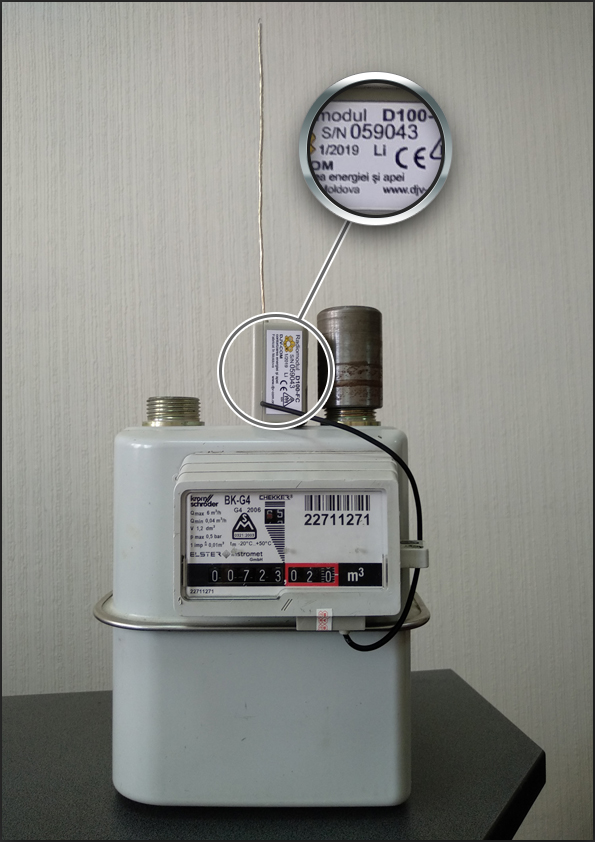
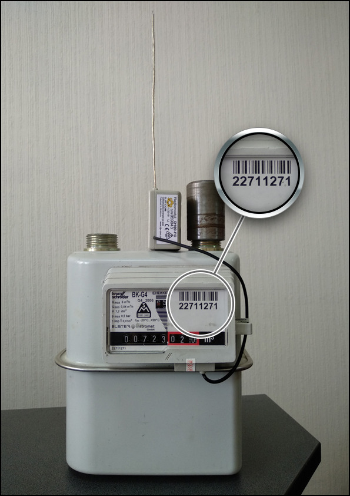

# 🏠 DJV-COM Meter  
**Home Assistant Custom Integration for [DJV-COM](https://djv-com.net/) Portal gas and utility meters used by Energocom and Moldovagaz in Moldova.**

---

## 📘 Overview  
`ha-djv_meter` is a **Home Assistant custom integration** that connects to the [DJV-COM](https://djv-com.net/web/public/pv/#/login) online portal to fetch gas meter data for gas meters in the Republic of Moldova.

## 📱 Official Mobile App
DJV-COM also publishes an official **"Balance mobile"** app that mirrors the same
BALANCE web portal this integration connects to. It's a useful reference if you
want to see what data is available or compare readings:

- Android: https://play.google.com/store/apps/details?id=com.djv.balance
- iOS: https://apps.apple.com/app/balance-mobile/id1569561297

It provides access to key metrics from your DJV-COM account:

- 📅 **Current Month** consumption  
- ⛽ **Gas Price**  
- 🕒 **Last Day** reading  
- 🔢 **Meter Indications**

To log in, you’ll need:
- The **serial number of your radio module** (used as **username**)  
- The **serial number of your meter** (used as **password**)

---

## 🔐 Login Information

| Field | Description | Example Image |
|:------|:-------------|:--------------|
| **Username** | The **serial number of your radio module** |  |
| **Password** | The **serial number of your meter** |  |

---

## ✨ Features  
✅ Secure connection to the DJV-COM web portal  
✅ Automatic data retrieval and updates  
✅ Home Assistant sensor entities for all readings  
✅ Easy setup through UI or YAML  
✅ Works with Lovelace dashboards and automations  

---

## 🧩 Requirements  
- Home Assistant (latest version recommended)  
- Active DJV-COM account  
- Radio Module Serial Number  
- Meter Serial Number  
- Internet connection to access the DJV-COM portal  
